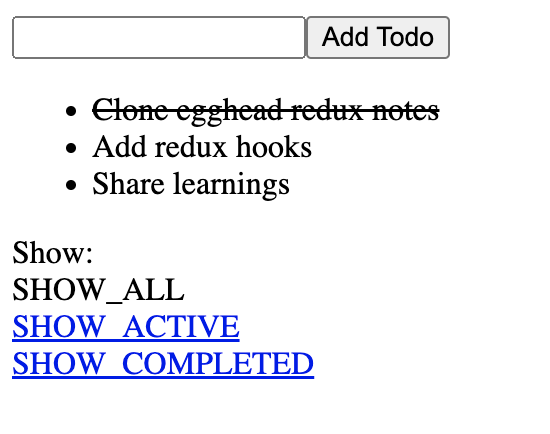

# Redux Notes

This repo follows [Redux Course Notes](https://github.com/tayiorbeii/egghead.io_redux_course_notes) in learning Redux through reverse engineering, the notes itself are based on Dan Abramov's [Redux video course](https://egghead.io/courses/fundamentals-of-redux-course-from-dan-abramov-bd5cc867).

Aim is to build a simple Todo app using Redux principles and API. At the end I've also added redux hooks as an upgrade. I've kept all logic in index.js to help with readability and quick reference to concepts.

## Screenshot

# Topics Covered

Each commit on this PR implements topics covered in origional Redux course notes. See [list of commits](https://github.com/zainsra7/redux_notes/commits/main) to main.

| Topic/Concept | Implementation 
| :---         |     :---:      
| [Writing Counter Reducer](https://github.com/tayiorbeii/egghead.io_redux_course_notes/blob/master/02-Reducer_and_Store.md)   | [SHA](https://github.com/zainsra7/redux_notes/commit/071d7cbbcc76f6190b3733f10c00cec45c966cad)     
| [Implementing createStore() from scratch](https://github.com/tayiorbeii/egghead.io_redux_course_notes/blob/master/03-Implementing_Store_from_Scratch.md)     | [SHA](https://github.com/zainsra7/redux_notes/commit/430a31c5484c45ba797cba28b25b12a9f411a721)       
| [Implementing Counter React component](https://github.com/tayiorbeii/egghead.io_redux_course_notes/blob/master/04-React_Counter_Example.md)     | [SHA](https://github.com/zainsra7/redux_notes/commit/e4c8f3d4e33b9aee0d44a92235d077b8c01db16c)       
| [Implementing todos reducer for adding and toggling a todo list](https://github.com/tayiorbeii/egghead.io_redux_course_notes/blob/master/07-Writing_a_Todo_List_Reducer.md)     | [SHA](https://github.com/zainsra7/redux_notes/commit/d2ec7d32c95a29443e42fd73acae17cecacad0f3)       
| [Reducer composition with Arrays](https://github.com/tayiorbeii/egghead.io_redux_course_notes/blob/master/08-Reducer_Composition_with_Arrays.md)     | [SHA](https://github.com/zainsra7/redux_notes/commit/d7457ec5f787e13ea8170e7299158db8769837b4)       
| [Reducer composition with Objects](https://github.com/tayiorbeii/egghead.io_redux_course_notes/blob/master/09-Reducer_Composition_with_Objects.md)     | [SHA](https://github.com/zainsra7/redux_notes/commit/6384f9e42c6c6eaf452fc0340f825e09605830cc)       
| [Reducer composition with combinedReducers](https://github.com/tayiorbeii/egghead.io_redux_course_notes/blob/master/10-Reducer_Composition_with_combineReducers.md)     | [SHA](https://github.com/zainsra7/redux_notes/commit/6d901f75458c0df3eb9405257f254438b741b3de)       
| [Implementing combinedReducers from scratch](https://github.com/tayiorbeii/egghead.io_redux_course_notes/blob/master/11-Implementing_combineReducers_from_Scratch.md)     | [SHA](https://github.com/zainsra7/redux_notes/commit/00cae7abc7b9b9c127bf84f526b751cf83000cd8)       
| [Todo Example (Add Todo)](https://github.com/tayiorbeii/egghead.io_redux_course_notes/blob/master/12-React_Todo_List_Example_Adding_a_Todo.md)    | [SHA](https://github.com/zainsra7/redux_notes/commit/7175b7d3a7c0e5adbdeecd6a6647c4c248f61ab5)       
| [Todo Example (Toggle Todo)](https://github.com/tayiorbeii/egghead.io_redux_course_notes/blob/master/13-React_Todo_List_Example_Toggling_a_Todo.md)    | [SHA](https://github.com/zainsra7/redux_notes/commit/60e2439882bcf7ad5eec820ac84ef600860679d6)       
| [Todo Example (Filtering Todos)](https://github.com/tayiorbeii/egghead.io_redux_course_notes/blob/master/14-React_Todo_List_Example_Filtering_Todos.md)    | [SHA](https://github.com/zainsra7/redux_notes/commit/191fdea1d67d90ef17b7091d78f98ed5a8301d5e)       
| [Extracting Presentational Components from TodoApp](https://github.com/tayiorbeii/egghead.io_redux_course_notes/blob/master/15-Extracting_Presentational_Components_Todo__TodoList.md)    | [SHA](https://github.com/zainsra7/redux_notes/commit/208bf8cbfdaf5743873c63e66e2d7bf5083b164e)       
| [Extracting Container Components](https://github.com/tayiorbeii/egghead.io_redux_course_notes/blob/master/17-Extracting_Container_Components_FilterLink.md)    | [SHA](https://github.com/zainsra7/redux_notes/commit/059d4a663e31b48d4038321d0efe46ec171752e1)       
| [Passing down store explicitly](https://github.com/tayiorbeii/egghead.io_redux_course_notes/blob/master/19-Passing_the_Store_Down_Explicitly_via_Props.md)    | [SHA](https://github.com/zainsra7/redux_notes/commit/7f1c75c50a0c37b76c33c15bc7a6036cf411ce65)       
| [Passing down store implicitly via Context](https://github.com/tayiorbeii/egghead.io_redux_course_notes/blob/master/20-Passing_the_Store_Down_Implicitly_via_Context.md)   | [SHA](https://github.com/zainsra7/redux_notes/commit/3e222b23252cf03adcfd673b988294c325cca8ba)       
| [Generating VisibleTodoList container with connect()](https://github.com/tayiorbeii/egghead.io_redux_course_notes/blob/master/22-Generating_Containers_with_connect_from_React_Redux_VisibleTodoList.md)   | [SHA](https://github.com/zainsra7/redux_notes/commit/c1bb37306b6730347f8d51169cc0883e9338c7fa)       
| [Generating AddTodo container with connect()](https://github.com/tayiorbeii/egghead.io_redux_course_notes/blob/master/23-Generating_Containers_with_connect_from_React_Redux_AddTodo.md)    | [SHA](https://github.com/zainsra7/redux_notes/commit/945e5b8ea6cbf1da9a88207bf875d85f100bcc7d)       
| [Generating FilterLink container with connect()](https://github.com/tayiorbeii/egghead.io_redux_course_notes/blob/master/24-Generating_Containers_with_connect_from_Readct_Redux_FooterLink.md)    | [SHA](https://github.com/zainsra7/redux_notes/commit/a6fcd11a9dae10731ede8a6f8f83571f12ee1604)       
| [Exracting Action Creators](https://github.com/tayiorbeii/egghead.io_redux_course_notes/blob/master/25-Extracting_Action_Creators.md)   | [SHA](https://github.com/zainsra7/redux_notes/commit/d8f41c1b1e67a25d9b4e9f069b3042d587d3b16a)       
| [Simplifying arror function](https://github.com/tayiorbeii/egghead.io_idiomatic_redux_course_notes/blob/master/01-Simplifying_the_Arrow_Functions.md)   | [SHA](https://github.com/zainsra7/redux_notes/commit/032a04db3159d0821ca617392b47414e842f1e3a)       
| [Add redux hooks (useSelector, useDispatch)](https://react-redux.js.org/api/hooks)   | [SHA](https://github.com/zainsra7/redux_notes/commit/c748586072081bef095d996edfe5b9916d1bd141)       

# Development

In the project directory, you can run:

### `npm start`

Runs the app in the development mode.\
Open [http://localhost:3000](http://localhost:3000) to view it in your browser.
